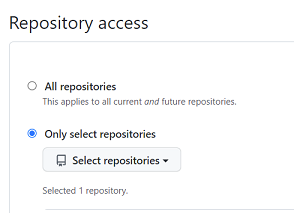
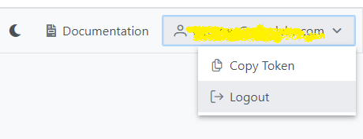

# hello-world
# 

## Run RAW Hello world!

By following the steps here after you should be able to run the basic Hello World! app in RAW.

1. RAW account 
To run this app, you need to be registered on raw-labs.com  
2. Visual Studio Code 
In VS Code, search for the RAW Labs extension in the standard Marketplace and install it. 
https://marketplace.visualstudio.com/items?itemName=RAWLabs.raw  
3. Clone this repository 
Clone this repository with your favorite CLI tool or with the VS Code Git extension.   
4. GitHub 
Log into your GitHub account, create a remote repository for the Hello World project, connect your local folder to the remote and commit there (more instructions [here](https://docs.github.com/en/get-started/importing-your-projects-to-github/importing-source-code-to-github/adding-an-existing-project-to-github-using-the-command-line) ). 
For RAW labs to be aware of the code you want to run, you need to install the RAW repository reader app. This application will synchronise your code with the RAW execution servers 
Go [there](https://github.com/apps/raw-repository-reader) and select your remote Hello World repository to allow RAW to access it 

  

5. In VS Code, connect to the execution server and verify it works correclty. 
Select the RAW Labs extension on the left menu bar in VS Code and choose the Scratchpad option at the top right. 
 

  

 
6. Run the test code
In the scratchpad window, on the top right, there is a green "Run" arrow. Click it to run the test code in the scratchpad. 
It should ask you for a token from the execution server.  
7. Get the RAW token 
Go to the [RAW admin console](https://app.raw-labs.com/) and get the token from the top right user's menu. 
 

  

Copy the token and paste it in VS Code when asked to. 
This will connect your IDE with the RAW execution server. 
You should now see the basic test code output on a JSON output tab  
8. Execute Hello World! 
In the RAW Extension file explorer, select the hellow-world.yml file and then on the green right arrow to run the file.  
10. Check if the app is up and running 
Go to the [RAW admin console](https://app.raw-labs.com), you should see hello-world in the repository menu and the corresponding enpoints in the catalog menu.  
From the catalog menu, you can copy the URL endpoint to your browser address bar and verify that it is working. 
It should be in this format https://`your-domain`.raw-labs.com/`publishUrl`/hello-world 
 

Endpoints :
## hello-world
hello-world

https://api.raw-labs.com/hello-world/hello-world

## hello-name
hello-name(name: string) 
returns "Hello `name`!"

https://api.raw-labs.com/hello-world/hello-name?name=Joe

